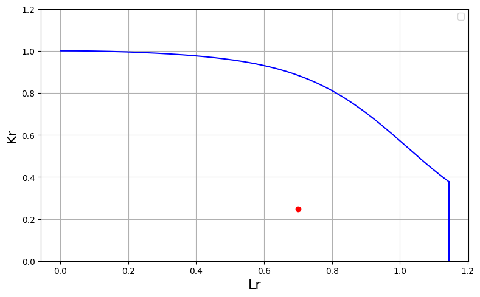
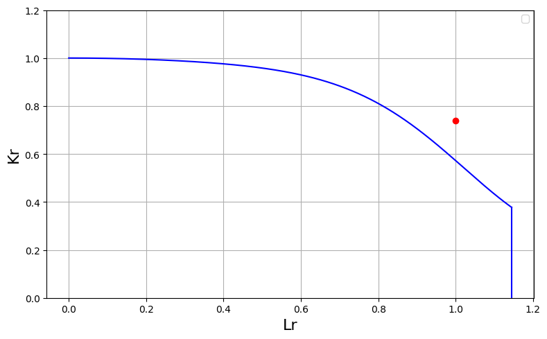

# 4.2 疲労亀裂進展評価の例題
## 設問2.1
まず最大荷重に対する解を求める。
```python
from FFSeval import FFS as ffs
cls=ffs.Treat()
Kmax=cls.Set('K_1_a_1')
print(Kmax.Title())
data={'a':6e-3,
      'c':6e-3,
      't':10e-3,
      'b':25e-3,
      'P':100e-3,#100kN->100e-3MN
      'M':0}
Kmax.SetData(data)
Kmax.Calc()
kmax=Kmax.GetRes()
print('KA,KB=',kmax['KA'],kmax['KB'])
```
その結果次の解が得られる。
```
平板の半楕円表面亀裂，Raju-Newmanの解
KA,KB= 19.642352887296376 24.08152463982535
```
次に最小荷重に対する解を求める。
```python
Kmin=cls.Set('K_1_a_1')
data={'a':6e-3,
      'c':6e-3,
      't':10e-3,
      'b':25e-3,
      'P':10e-3,#100kN->100e-3MN
      'M':0}
Kmin.SetData(data)
Kmin.Calc()
kmin=Kmin.GetRes()
print('KA,KB=',kmin['KA'],kmin['KB'])
```
その結果次の解が得られる。
```
KA,KB= 1.9642352887296375 2.4081524639825354
```
応力拡大係数変動幅の評価を行う。
```python
DK_A=kmax['KA']-kmin['KA']
DK_B=kmax['KB']-kmin['KB']
print(f'DK_A,DK_B={DK_A,DK_B}')
```
その結果次の解が得られる。
```
DK_A,DK_B=(np.float64(17.67811759856674), np.float64(21.673372175842815))
```

## 設問2.2 1サイクル分の亀裂進展評価
```python
from FFSeval import FFS as ffs
cls=ffs.Treat()
K=cls.Set('K_1_a_1')
print(K.Title())
data={'a':6e-3,
      'c':6e-3,
      't':10e-3,
      'b':25e-3,
      'M':0}
K.SetData(data)
fat=ffs.Fatigue(K,data)
```
1サイクル分の亀裂進展評価。
```python
#設問2.2
a0=6.0e-3
c0=6.0e-3
Pmin=10e-3
Pmax=100e-3
R=Pmin/Pmax
cycle=1
res0,res1,crack=fat.EvalAC(a0,c0,Pmin,Pmax,R,cycle)
da=crack['a']-a0
dc=crack['c']-c0
print('da,dc=',da,dc)
```
その結果，次の解を得る。
```
da,dc= 2.920880191360775e-08 5.4598346063867986e-08
```

## 設問2.3 100サイクル分の亀裂進展評価
```python
# 設問2.3
cycle=100
res0,res1,crack=fat.EvalAC(a0,c0,Pmin,Pmax,R,cycle)
a100=crack['a']
c100=crack['c']
print('a100,c100=',a100,c100*2.0)
```
その結果，次の解を得る。
```
da,dc= 0.00600292373890182 0.012010928505219181
```

## 設問2.4 1000サイクル分の亀裂進展評価
```python
#設問2.4
cycle=1000
res0,res1,crack=fat.EvalAC(a0,c0,Pmin,Pmax,R,cycle)
a=crack['a']
c=crack['c']*2
print('a,2c=',a,c)
```
その結果，次の解を得る。
```
a,2c= 0.006029499787035132 0.012110097063618732
```

## 設問2.5 平板の半楕円表面亀裂に対する2パラメータ評価
K値の評価にはK-1-a-1を，L値の評価にはL-1-aを使うものとする。なお，テキストには，評価に用いた方法が明記されておらず，以下の解析とは数値が異なっている。

```python
from FFSeval import FFS as ffs
cls=ffs.Treat()
K=cls.Set('K-1-a-1')
print(K.Title())
data={'a':20e-3,
      'c':15e-3,
      't':40e-3,
      'b':100e-3,
      'P':2000e-3,
      'M':0,
      'Su':490,
      'Sy':380,
      'E':192e3,
      'Nu':0.3,
      'J1c':0.1}
K.SetData(data)
K.Calc()
resK=K.GetRes()
Kc=K.CalcKc()
Kr=resK['KA']/Kc
L=cls.Set('L-1-a')
L.Title()
L.SetData(data)
L.Calc()
resL=L.GetRes()
Lr=resL['Lr']
res=L.Margin(Kr,Lr)
print('Kr,Lr=',Kr,Lr)
print('Margin=',res['margin'])
```
その結果，次の解を得る。
```
Kr,Lr= 0.2465013017010324 0.700703225084256
Margin= 0.6210033190241498
```
R6法のOption1評価で，限界値となったときにMargin=1.0となる。ちなみに，インスタンスKやLの親クラスには，メソッドとして破壊評価曲線の描画機能を持っている。以下により実行する。
```python
K.DrawOption1(Lr,Kr,data['Su'],data['Sy'])
```
以下の図が描画されることを確認されたい。赤点が計算点であることを示す。



## 設問2.6 疲労亀裂進展評価
設定している応力拡大係数公式のインスタンスを用いた疲労亀裂進展評価用のインスタンスを生成する。疲労亀裂進展特性はJSME維持規格における炭素鋼および低合金鋼の大気中における疲労亀裂進展特性を用いている。
```python
fat=ffs.Fatigue(K,data)
```
疲労亀裂進展の条件を以下のように設定する。
```python
a0=20e-3
c0=15e-3
Pmin=0.0
Pmax=800e-3
R=0.0
cycle=370000
```
テキストではcycle=350000となっているが，この条件では破損に到達しないため，370000に変更した。疲労亀裂進展解析を以下により実行する。
```python
res0,res1,crack=fat.EvalAC(a0,c0,Pmin,Pmax,R,cycle)
```
res0,res1には，亀裂進展前後の応力拡大係数が辞書形式で格納されている。crackには，最終亀裂長さが辞書形式で格納されている。

## 設問2.7 疲労亀裂進展後の2パラメータ評価
最終亀裂長さに対する安全評価を以下により実施する。
```python
data['a']=crack['a']
data['c']=crack['c']
data['P']=2000e-3
K.SetData(data)
K.Calc()
resK=K.GetRes()
Kr=resK['KA']/Kc
L.SetData(data)
L.Calc()
resL=L.GetRes()
Lr=resL['Lr']
print('Kr,Lr=',Kr,Lr)
L.Margin(Kr,Lr)
```
その結果，次の解を得る。
```
Kr,Lr= 0.7399150711660912 0.9998884609444885
{'L0': 0.9198561106943169,
 'K0': 0.6806913232742423,
 'margin': 1.087005292805809}
```
 marginが1を超過しているので，破損限界を超過したことが確認できる。破壊評価曲線に描画した結果が以下である。計算点は破壊評価曲線の上側に位置していることが確認できる。
```python
K.DrawOption1(Lr,Kr,data['Su'],data['Sy'])
```
 


