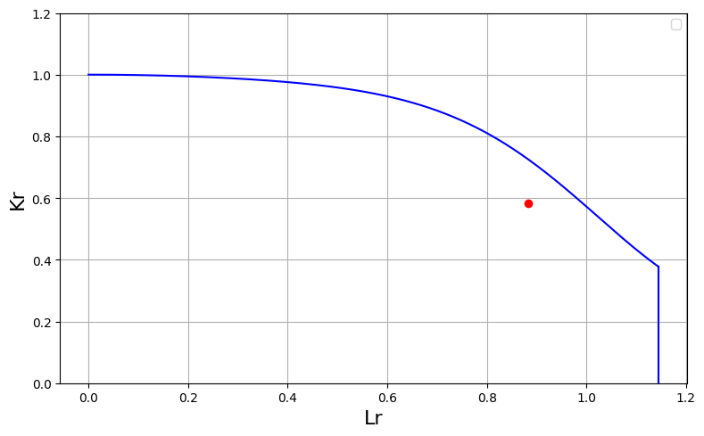
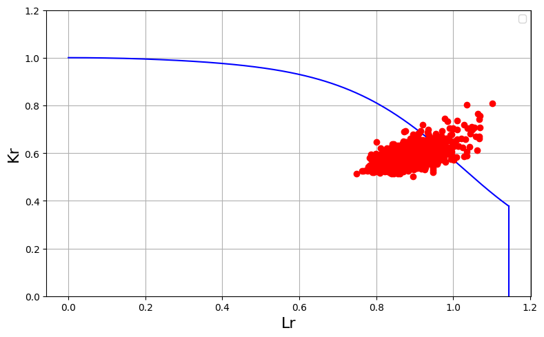

# 確率論的破壊力学(Probabilistic Fracture Mechanics, PFM)例題
## 概要
本例題はテキストには掲載されていない。破壊力学に確率論的取り扱いを導入して評価することを確率論的破壊力学(Probabilistic Fracture Mechanics, PFM)と呼ぶ。ここでは，板表面に表面亀裂が存在する場合について，疲労亀裂進展後の破損確率評価にPFMを適用する例題を設定する。破損評価には2パラメータ法を用いることとする。問題設定は，基本的には設問2.7と同様である。

## 決定論的評価
まず，設問2.7と条件は同一で，疲労荷重の繰り返し回数を350000回とする場合の，疲労亀裂進展後の破壊評価を決定論にもとづき，評価してみる。コードは下記の通りである。
```python
from FFSeval import FFS as ffs
import numpy as np
import math
cls=ffs.Treat()
K=cls.Set('K-1-a-1')
L=cls.Set('L-1-a')
data={'a':20e-3,
      'c':15e-3,
      't':40e-3,
      'b':100e-3,
      'P':2000e-3,
      'M':0,
      'Su':490,
      'Sy':380,
      'E':192e3,
      'Nu':0.3,
      'J1c':0.1}
Pmin=0.
Pmax=800e-3
R=Pmin/Pmax
cycle=350000
fat=ffs.Fatigue(K,data)
res0,res1,crack=fat.EvalAC(data['a'],data['c'],Pmin,Pmax,R,cycle)
data['a']=crack['a']
data['c']=crack['c']
data['P']=2000e-3
K.SetData(data)
K.Calc()
resK=K.GetRes()
Kr=resK['KA']/Kc
L.SetData(data)
L.Calc()
resL=L.GetRes()
Lr=resL['Lr']
print('Kr,Lr=',Kr,Lr)
L.Margin(Kr,Lr)
K.DrawOption1(Lr,Kr,490,380)
```
この結果，以下の破壊評価戦図が描画される。


この結果，評価点は破壊評価曲線の下側に位置しており，安全と評価される。しかし，この評価は，パラメータの統計的バラツキを考慮していない。バラツキを考慮した場合には，その一部は破損領域に突入するケースも存在する可能性がある。このような懸念を解消するためには，PFMの実行が求められる。

## 確率論的評価
パラメータの統計的要素として以下を考慮する。
- 初期亀裂分布。対数正規分布とし，その平均はa=20e-3とする。cはa*0.75を割り当てる。
- 疲労亀裂進展曲線のC値について，JSME維持規格における炭素鋼および低合金鋼の大気中における疲労亀裂進展特性を平均値とする正規分布として設定する。COV値を設定する。
- 降伏応力を正規分布として設定する。

上記の条件のもとに，モンテカルロ法を実施し，確率論的特性を評価するコードが下記である。サンプル数n_sampleに大きな数値を与えると，大きな計算時間を必要とするので，注意が必要である。
```python
a_cov=0.01 #亀裂長のcov
C_cov=0.01 #疲労亀裂進展曲線C値のcov
Sy_cov=0.05
a_mean=20e-3
a_std=20e-3*a_cov
n_sample=1000 #サンプル数
Kr=[]
Lr=[]
K.SetData(data)
Kc=K.CalcKc()
fat=ffs.Fatigue(K,data,pfm=True,cov=C_cov)
#亀裂長分布は対数正規分布とする。乱数で発生する。
# 対数正規分布のパラメータに変換
sigma_ln = np.sqrt(np.log(1 + (a_std / a_mean)**2))
mu_ln = np.log(a_mean) - 0.5 * sigma_ln**2
a_samples = np.random.lognormal(mean=mu_ln, sigma=sigma_ln, size=n_sample)
c_samples=a_samples*3./4.
Sy_samples=np.random.normal(loc=data['Sy'],scale=data['Sy']*Sy_cov, size=n_sample)
for i in range(n_sample):      
      res0,res1,crack=fat.EvalAC(a_samples[i],c_samples[i],Pmin,Pmax,R,cycle)
      data['a']=crack['a']
      data['c']=crack['c']
      data['P']=2000e-3
      data['Sy']=Sy_samples[i]
      K.SetData(data)
      K.Calc()
      resK=K.GetRes()
      Krv=resK['KA']/Kc
      Kr.append(Krv)
      L.SetData(data)
      L.Calc()
      resL=L.GetRes()
      Lrv=resL['Lr']
      Lr.append(Lrv)
Kr = [x for x in Kr if not math.isnan(x)]
Lr = [x for x in Lr if not math.isnan(x)]
K.DrawOption1(Lr,Kr,490,380)
```
その結果，以下の図が描画される。


その結果，一部の結果は破損領域に到達していることが確認できる。破損確率は以下のように評価できる。
```python
margin=[]
for Kv,Lv in zip(Kr,Lr):
    res=L.Margin(Kv,Lv)
    margin.append(res['margin'])
failure = len([x for x in margin if x >= 1])
Pf=failure/len(Kr)
Pf
#0.093
```
約9%は破損領域に到達していることが分かる。このように，決定論的評価では，安全領域と評価されても，統計的性質を考慮すると，ある確率では，破損領域に到達するものが存在することが分かる。確率論的破壊力学評価により，どの程度の危険性があるかを定量的に評価することが可能となる。
