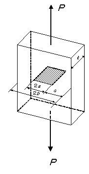

```python
from FFSeval import FFS as ffs
cls=ffs.Treat()
K=cls.Set('J-1-d')
data={'a':15,
      'c':30,
      'b':100,
      'L':100.,
      't':40,
      'P':5.8e4,
      'n':7.0,
      'S0':313.6,
      'plane':'strain',
      'epsilon0':313.6/192.08e3,
    'E':192.08e3,
        'Nu':0.3,
        'alpha':5.5,
      }
K.SetData(data)
K.Calc()
res=K.GetRes()
res
#{'JA': 133992.29664647309, 'JB': 133992.29664647309}
```
