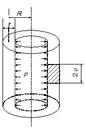

```python
from FFSeval import FFS as ffs
cls=ffs.Treat()
K=cls.Set('J-2-e')
data={'c':15,
      'R':200.,
      't':20,
      'p':20.,
      'E':192.08e3,
      'sigma_f':313.6,
      }
K.SetData(data)
K.Calc()
res=K.GetRes()
res
#{'J': 13.237240732402013}
```
