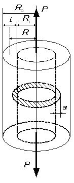

```python
from FFSeval import FFS as ffs
cls=ffs.Treat()
K=cls.Set('J-2-h')
data={'a':10.,
      'Ri':200.,
      'R':210.,
      'Ro':220.,
      't':20.,
      'P':4e6,
      'n':5.0,
      'Sy':313.6,
       'alpha':5.5,
      'plane':'strain',
      'sigma0':313.6,
      'epsilon0':313.6/192.08e3,
    'E':192.08e3,
        'Nu':0.3,
      }
K.SetData(data)
K.Calc()
res=K.GetRes()
res
#{'J': 31.46057469897512}
```
