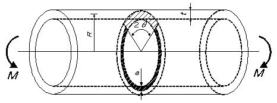

```python
from FFSeval import FFS as ffs
import numpy as np
cls=ffs.Treat()
K=cls.Set('J-2-m')
data={'R':53,
    't':9,
    'a':3.,
    'theta':50*np.pi/180,
    'M':5e5,
    'n':7.0,
    'E':192.08e3,
    'Nu':0.3,
    'Sy':313.6,
    'Su':490.0,
    'sigma0':313.6,
    'epsilon0':313.6/192.08e3,
    'Case':'Collapse',#塑性崩壊値の計算のとき'Collapse',塑性崩壊軸強度のとき'PR',軸荷重J値のとき'PJ',塑性崩壊曲げ強度のとき'MR',曲げ荷重J値のとき'MJ'
    'e0':313.6/192.08e3,
    'alpha':5.5,
    'plane':'strain',
    'JR':1.176*0.25e-3**0.44,
    'J1c':0.784e3
    }
K.SetData(data)
K.Calc()
res=K.GetRes()
res
#{'J': 0.12157038034631693}
```
