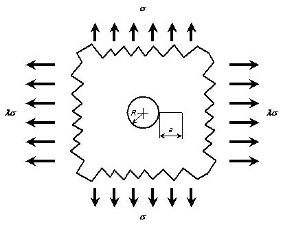

```python
from FFSeval import FFS as ffs
cls=ffs.Treat()
J=cls.Set('J-7-a')
data={
    'a':11e-3,
    'R':0.01,
    'alpha':5.5,
    'n':7,
    'S':330,
    'S0':313.6,
    'E':192e3
}
J.SetData(data)
J.Calc()
J.GetRes()
#{'J': 0.2410953125980766}

```
