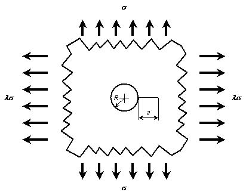

```python
from FFSeval import FFS as ffs
cls=ffs.Treat()
J=cls.Set('J-7-a')
data={
    'a':0.01*0.3,
    'R':0.01,
    'alpha':5.5,
    'n':2.5,
    'sigma':330,
    'sigma0':313.6,
    'E':192e3
}
J.SetData(data)
J.Calc()
J.GetRes()
#{'J': 0.14335571327451752}

```
