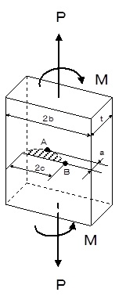

```python
from FFSeval import FFS as ffs
cls=ffs.Treat()
K=cls.Set('K-1-a-1')
print(K.Title())
data={'a':10,
      'c':30,
      'b':100,
      't':40,
      'P':3.8e7,
      'M':5.0e5}
K.SetData(data)
K.Calc()
K.GetRes()
#平板の半楕円表面亀裂，Raju-Newmanの解
#{'KA': 28383.37159904204, 'KB': 18391.925464059223}

```
