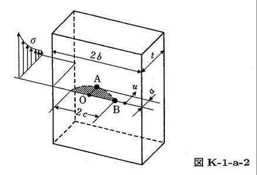

```python
from FFSeval import FFS as ffs
cls=ffs.Treat()
K=cls.Set('K-1-a-2')
print(K.Title())
data={'a':10e-3,
      'c':30e-3,
      't':40e-3,
      'Sy':380,
      'sigma0':50.0,
      'sigma1':-42.143,
      'sigma2':-3.571,
      'sigma3':15.714}
K.SetData(data)
K.Calc()
K.GetRes()
# 半楕円表面き裂 ASME Section XI, Appendix A の解
# {'KA': 5.226514393344583, 'KB': 5.128123890300543}

```
