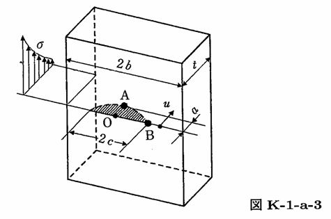

```python
from FFSeval import FFS as ffs
cls=ffs.Treat()
K=cls.Set('K-1-a-3')
data={'a':10e-3,
      'c':30e-3,
      't':40e-3,
      'Sy':380,
      'sigma0':50.0,
      'sigma1':-42.143,
      'sigma2':-3.571,
      'sigma3':15.714}
K.SetData(data)
K.Calc()
res=K.GetRes()
res
#{'KA': 6.466855504266251, 'KB': 2.6883628116803386}
```
