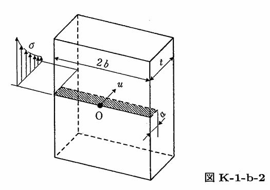

```python
from FFSeval import FFS as ffs
cls=ffs.Treat()
K=cls.Set('K-1-b-2')
data={'a':10,
      't':40,
      'sigma0':10.,
      'sigma1':0.,
      'sigma2':0.,
      'sigma3':0.}
K.SetData(data)
K.Calc()
res=K.GetRes()
res
#{'K': 34.1782420565439}
```
