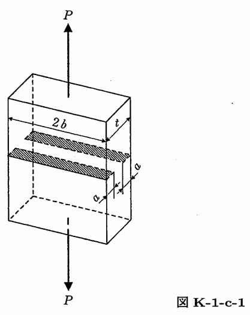

```python
from FFSeval import FFS as ffs
cls=ffs.Treat()
K=cls.Set('K-1-c-1')
data={
    't':16,
    'a':4.0,
    'b':100,
    'P':1000}
K.SetData(data)
K.Calc()
res=K.GetRes()
res
#{'K': 1.2881249999999997}
```
