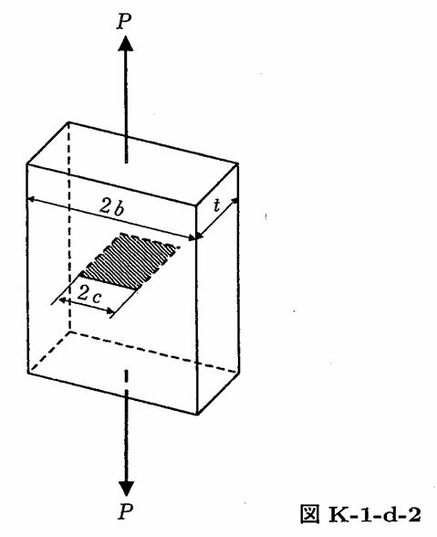

```python
from FFSeval import FFS as ffs
cls=ffs.Treat()
K=cls.Set('K-1-d-2')
data={
    't':16,
    'c':4.0,
    'b':100,
    'P':1000}
K.SetData(data)
K.Calc()
res=K.GetRes()
res
#{'K': 1.1088340712310085}
```
