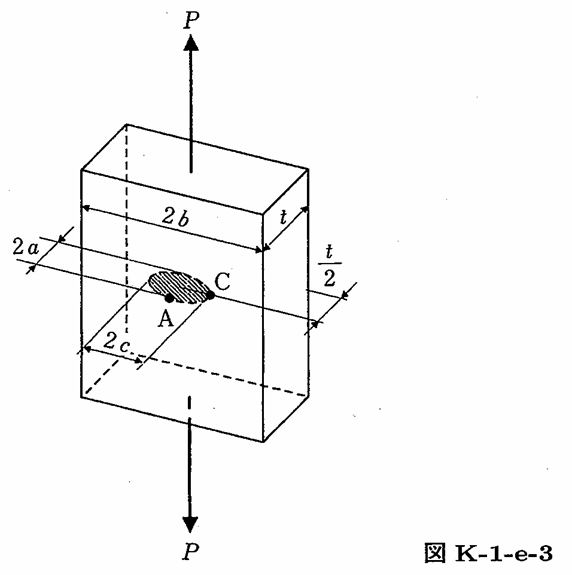

```python
from FFSeval import FFS as ffs
cls=ffs.Treat()
K=cls.Set('K-1-e-3')
data={'a':10,
      'c':30,
      'b':100,
      't':40,
      'P':3.8e7}
K.SetData(data)
K.Calc()
res=K.GetRes()
res
#{'KA': 24572.130377539143, 'KC': 14162.975988557064}
```
