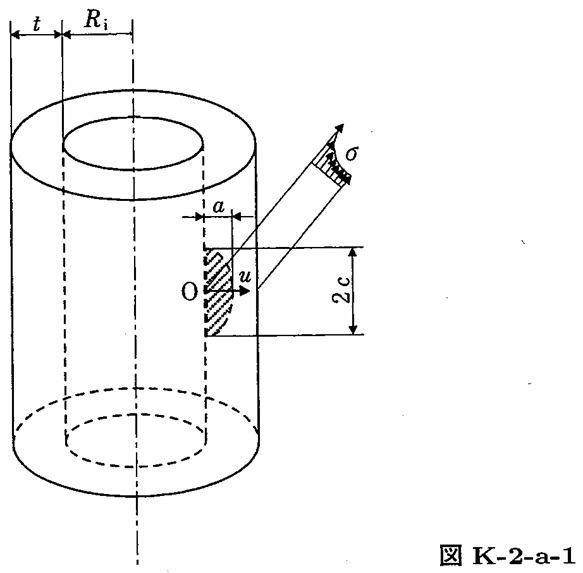

```python
from FFSeval import FFS as ffs
cls=ffs.Treat()
K=cls.Set('K-2-a-1')
data={
    'Ri':275,
    't':16,
    'a':0.8,
    'c':2.4,
    'sigma0':10,
    'sigma1':0,
    'sigma2':0,
    'sigma3':0}
K.SetData(data)
K.Calc()
res=K.GetRes()
res
#{'KA': 8.345699382302255, 'KB': 6.610985918151353}

```

