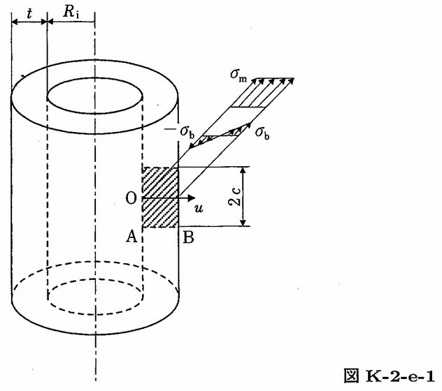

```python
from FFSeval import FFS as ffs
cls=ffs.Treat()
K=cls.Set('K-2-e-1')
data={
    'Ri':275,
    't':16,
    'c':0.8,
    'sigma_m':10,
    'sigma_b':2
}
K.SetData(data)
K.Calc()
res=K.GetRes()
res
#{'KA': 20.947890540257003, 'KB': 12.601853151351072}
```
