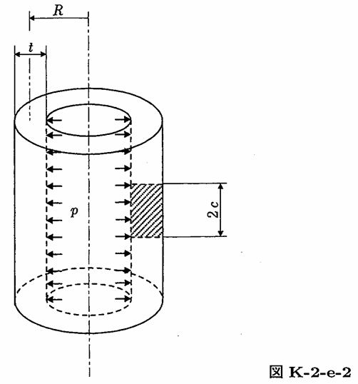

```python
from FFSeval import FFS as ffs
cls=ffs.Treat()
K=cls.Set('K-2-e-2')
data={
    'R':283,
    't':16,
    'p':8,
    'c':5.0}
data['R']=(data['Ro']+data['Ri'])/2.0
K.SetData(data)
K.Calc()
res=K.GetRes()
res
#{'K': 565.7851092410826}

```


