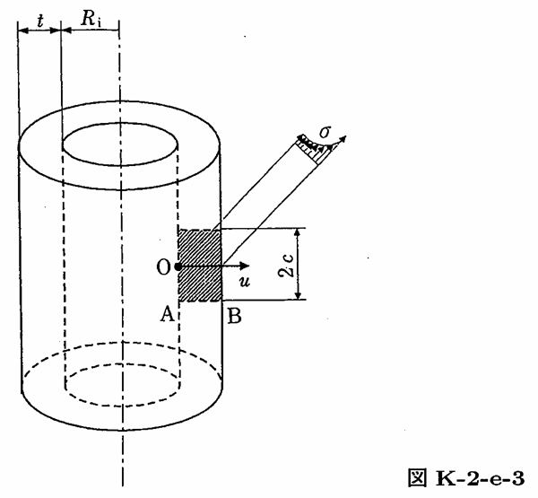

```python
from FFSeval import FFS as ffs
cls=ffs.Treat()
K=cls.Set('K-2-e-3')
data={
    'Ro':291,
    'Ri':275,
    't':16,
    'c':0.8,
    'sigma0':10,
    'sigma1':0,
    'sigma2':0,
    'sigma3':0,
    'sigma4':0
}
```
K.SetData(data)
K.Calc()
res=K.GetRes()
res
#{'KA': 16.950375257843696, 'KB': 16.274032687487924}
