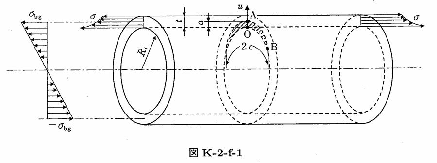

```python
from FFSeval import FFS as ffs
cls=ffs.Treat()
K=cls.Set('K-2-f-1')
data={
    'Ri':275,
    't':16,
    'c':0.8,
    'a':0.2,
    'sigma0':10,
    'sigma1':0,
    'sigma2':0,
    'sigma3':0,
    'sigma_bg':2.0
}
K.SetData(data)
K.Calc()
res=K.GetRes()
res
#{'KA': 0.6279737929212376, 'KB': 0.9530413235765421}
```
