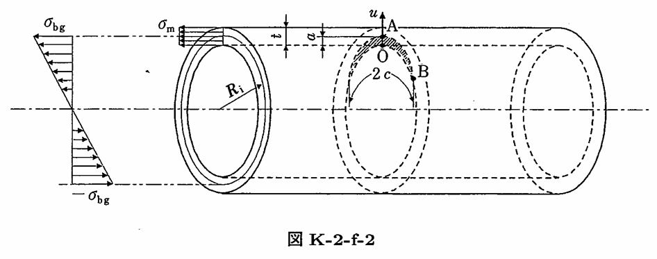

```python
from FFSeval import FFS as ffs
cls=ffs.Treat()
K=cls.Set('K-2-f-2')
data={
    'Ri':275,
    't':16,
    'c':8,
    'a':2,
    'sigma_m':10,
    'sigma_bg':2.0
}
K.SetData(data)
K.Calc()
res=K.GetRes()
res
#{'KA': 30.64837070985107, 'KB': 16.331094791932692}
```
