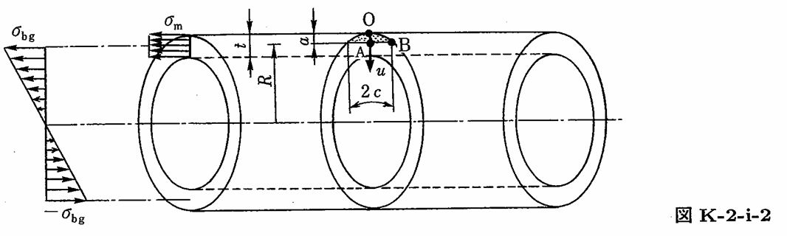

```python
from FFSeval import FFS as ffs
cls=ffs.Treat()
K=cls.Set('K-2-i-2')
data={
    'Ri':275,
    't':16,
    'a':5.0,
    'c':10.0,
    'sigma_m':10,
    'sigma_bg':4.0
    }
K.SetData(data)
K.Calc()
res=K.GetRes()
res
#{'KA': 51.5631896442937, 'KB': 41.094768619585714}
```
