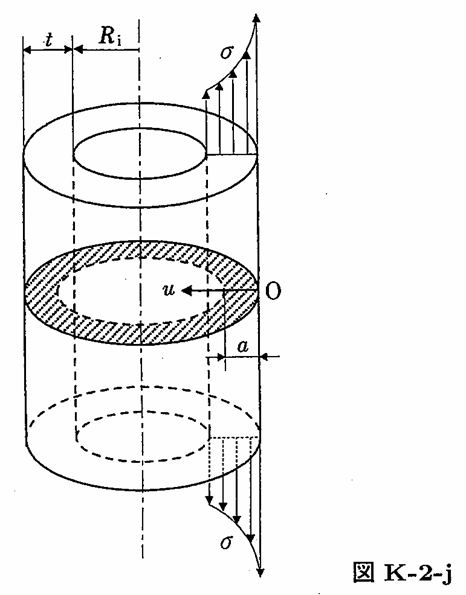

```python
from FFSeval import FFS as ffs
cls=ffs.Treat()
K=cls.Set('K-2-j')
data={
    'Ri':275,
    't':16,
    'a':2,
    'sigma0':10,
    'sigma1':0,
    'sigma2':0,
    'sigma3':0,
    'sigma4':0,
    }
K.SetData(data)
K.Calc()
res=K.GetRes()
res
#{'K': 30.07755584327489}
```
