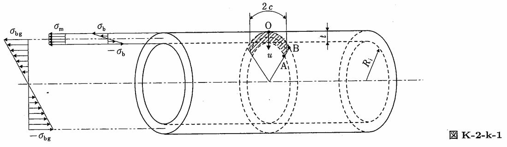

```python
from FFSeval import FFS as ffs
cls=ffs.Treat()
K=cls.Set('K-2-k-1')
data={
    'Ri':275,
    't':16,
    'c':2,
    'sigma_m':10,
    'sigma_b':2,
    'sigma_bg':3,
    }
K.SetData(data)
K.Calc()
res=K.GetRes()
res
#{'KA': 36.037411115349585, 'KB': 27.915574850595387}
```
