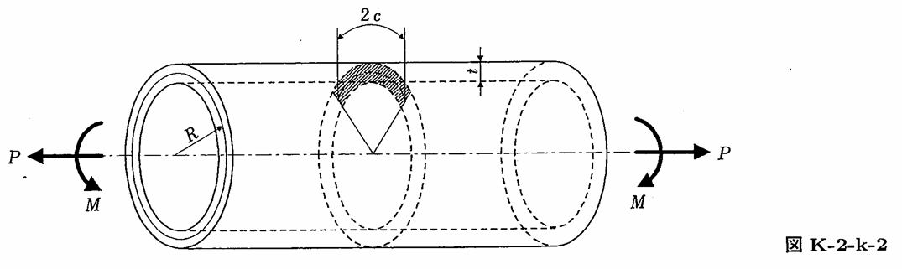

```python
import numpy as np
from FFSeval import FFS as ffs
cls=ffs.Treat()
K=cls.Set('K-2-k-2')
S0=313.6
E=192.08e3
R=60
th=30.0*np.pi/180.0
c=R*th
data={'R':R,
      'c':c,
    't':10,
    'th':th,
    'M':1.96e7,
    'P':0.0,
    'n':7.0,
    'E':E,
    'Nu':0.3,
    'Sy':S0,
    'Su':490.0,
    'S0':S0,
    'e0':S0/E,
    'alpha':5.5,
    'plane':'strain',
    'Case':'Collapse',
    'J1c':0.784e3
    }
print(K.Title())
K.SetData(data)
K.Calc()
res=K.GetRes()
res
#周方向貫通亀裂，ASME Code Case N-513の解
#{'K': 2070.0239337623207}

```
