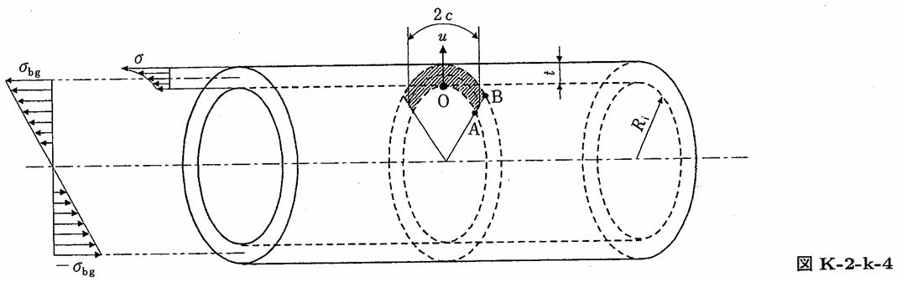

```python
from FFSeval import FFS as ffs
cls=ffs.Treat()
K=cls.Set('K-2-k-4')
data={
    'Ri':275,
    't':16,
    'c':0.8,
    'sigma0':10,
    'sigma1':0,
    'sigma2':0,
    'sigma3':0,
    'sigma4':0,
    'sigma_bg':5.0
    }
K.SetData(data)
K.Calc()
res=K.GetRes()
res
#{'KA': 7.4705967284536055, 'KB': 24.023883438846834}
```
