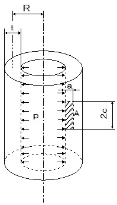

```python
from FFSeval import FFS as ffs
cls=ffs.Treat()
K=cls.Set('K-2-l')
data={
    'R':293,

    't':16,
    'c':0.8,
    'a':0.2,
      'p':10.,
    }
K.SetData(data)
K.Calc()
res=K.GetRes()
res
#{'KA': 152.58107588918787}
```
