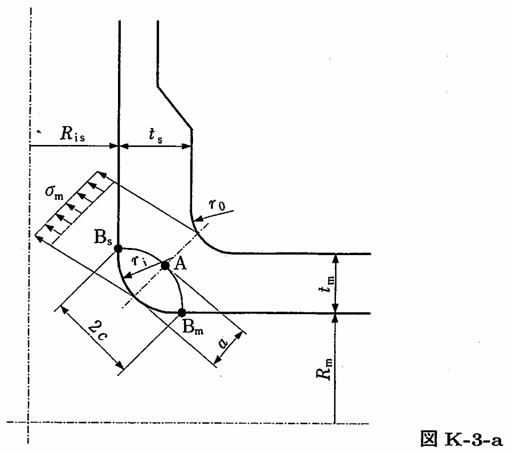

```python
from FFSeval import FFS as ffs
cls=ffs.Treat()
K=cls.Set('K-3-a')
data={
    'ri':10.0,
    'tm':26,
    'a':5.0,
    'c':10.0,
    'sigma_m':20.0
    }
K.SetData(data)
K.Calc()
res=K.GetRes()
res
#{'KA': 48.20310998402074, 'KBm': 37.05407448522826, 'KBs': 37.33249368274033}
```
