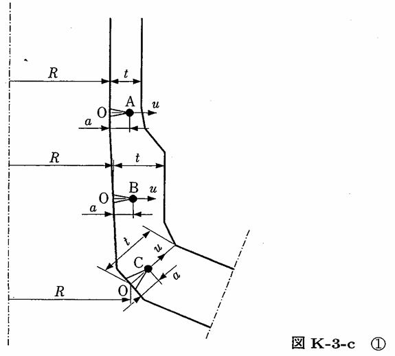

```python
from FFSeval import FFS as ffs
cls=ffs.Treat()
K=cls.Set('K-3-c')
data={
    'a':12.,
    't':25.,
    'Ri':150.,
    'sigma0':20.0,
    'sigma1':0,
    'sigma2':0,
    'sigma3':0
    }
K.SetData(data)
K.Calc()
res=K.GetRes()
res
#{'KA': 189.57295619419767, 'KB': 164.61103529045582, 'KC': 190.7444744248055}
```
