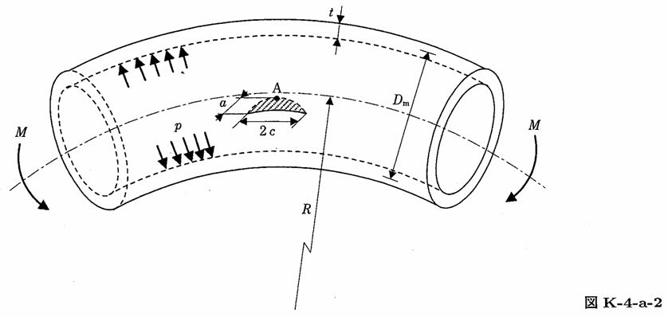

```python
from FFSeval import FFS as ffs
cls=ffs.Treat()
K=cls.Set('K-4-a-2')
data={
    'a':12.,
    'c':40.,
    't':20.,
    'R':150.,
    'Dm':200.,
    'M':2.5e5,
    'p':10.0
    }
K.SetData(data)
K.Calc()
res=K.GetRes()
res
#{'KA': 928.4307490552533}
```
