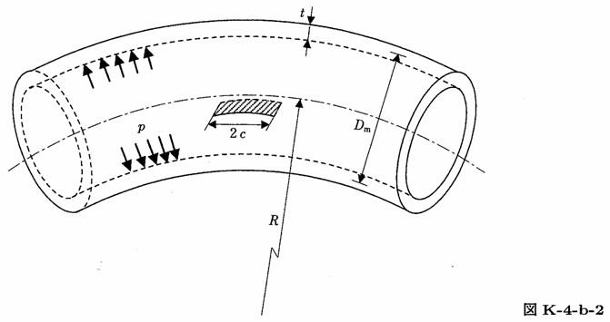

```python
from FFSeval import FFS as ffs
cls=ffs.Treat()
K=cls.Set('K-4-b-2')
data={
    'c':30.,
    't':7.,
    'R':150.,
    'Dm':100.,
    'p':10.0
    }
K.SetData(data)
K.Calc()
res=K.GetRes()
res
#{'K': 1375.6815878457064}
```
