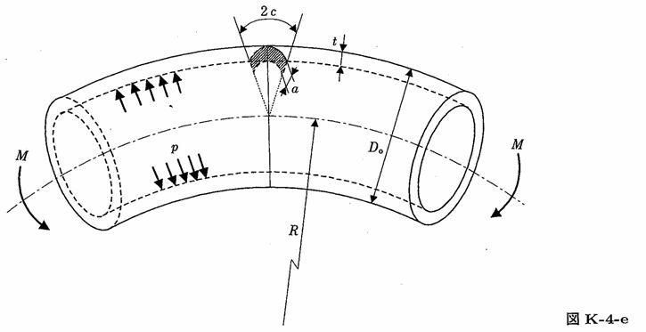

```python
from FFSeval import FFS as ffs
cls=ffs.Treat()
K=cls.Set('K-4-e')
data={
    'c':30.,
    't':6.,
    'R':150.,
    'Dm':100.,
    'p':10.0,
    'M':2e5
    }
K.SetData(data)
K.Calc()
res=K.GetRes()
res
#{'K': 779.9589962356163}
```
