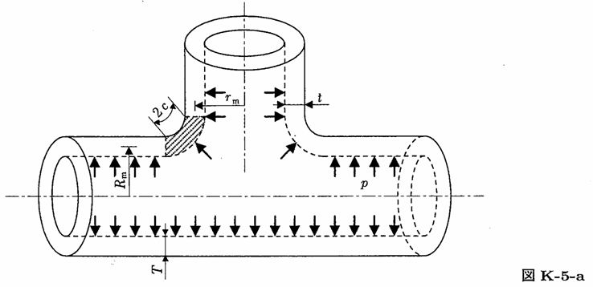

```python
from FFSeval import FFS as ffs
cls=ffs.Treat()
K=cls.Set('K-5-a')
data={
    'c':10.,
    't':12.,
    'T':20.,
    'rm':90.,
    'Rm':120.,
    'p':10.0,
    }
K.SetData(data)
K.Calc()
res=K.GetRes()
res
#{'K': 1025.2463099994545}
```
