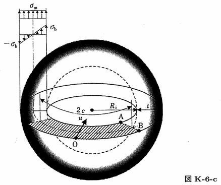

```python
from FFSeval import FFS as ffs
cls=ffs.Treat()
K=cls.Set('K-6-c')
data={
    'c':100.,
    't':20.,
    'Ri':150.,
    'sigma_m':20.0,
    'sigma_b':5.,

    }
K.SetData(data)
K.Calc()
res=K.GetRes()
res
#{'KA': 1172.8327131441802, 'KB': 346.78059592966423}
```
