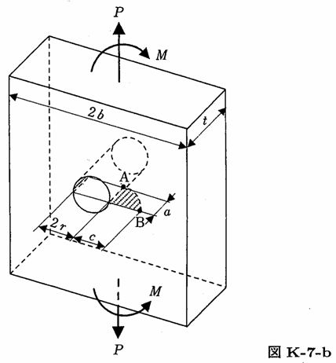

```python
from FFSeval import FFS as ffs
cls=ffs.Treat()
K=cls.Set('K-7-b')
data={
    'c':5.,
    'r':3.,
    'a':5.,
    'b':100.,
    't':6.,
    'P':100.,
    'M':20.
    }
K.SetData(data)
K.Calc()
res=K.GetRes()
res
#{'KA': 0.2201646191854179, 'KB': 0.31265662671655753}
```
