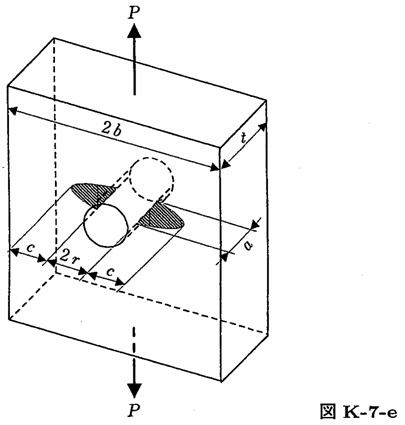

```python
from FFSeval import FFS as ffs
cls=ffs.Treat()
K=cls.Set('K-7-e')
data={
    'c':5.,
    'a':4.,
    'r':8.,
    'b':100.,
    't':6.,
    'P':100.,
    }
K.SetData(data)
K.Calc()
res=K.GetRes()
res
#{'K_A': 0.6021799972673709, 'K_B': 0.32021923475706665}
```
