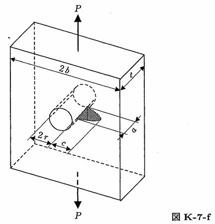

```python
from FFSeval import FFS as ffs
cls=ffs.Treat()
K=cls.Set('K-7-f')
data={
    'c':5.,
    'a':4.,
    'r':8.,
    'b':100.,
    't':6.,
    'P':100.,
    }
K.SetData(data)
K.Calc()
res=K.GetRes()
res
#{'KA': 0.5638408457340023, 'KB': 0.29983175290618824}
```
