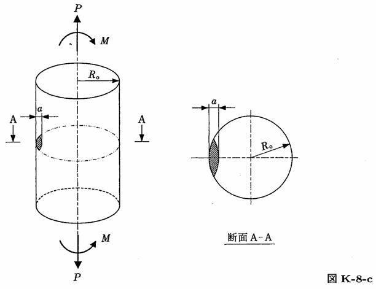

```python
from FFSeval import FFS as ffs
cls=ffs.Treat()
K=cls.Set('K-8-c')
data={
    'a':10.,
    'Ro':50.,
    'P':1e4,
    'M':200.
    }
K.SetData(data)
K.Calc()
res=K.GetRes()
res
#{'K': 5.004925479464316}
```
