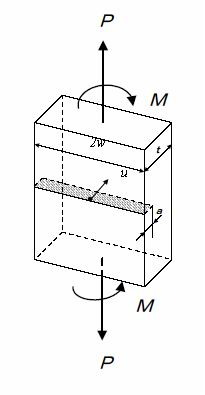

```python
from FFSeval import FFS as ffs
cls=ffs.Treat()
L=cls.Set('L-1-b')
data={'a':20e-3,
      't':40e-3,
      'w':100e-3,
      'P':200e-3,
      'M':0,
      'Su':490,
      'Sy':380,
      'E':192e3,
      'Nu':0.3,
      'J1c':0.1}
L.SetData(data)
L.Calc()
resL=L.GetRes()
resL
#{'Lr': 0.3176596792596178}
```
