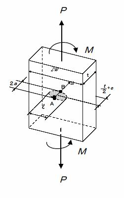

```python
from FFSeval import FFS as ffs
cls=ffs.Treat()
K=cls.Set('L-1-e')
from FFSeval import FFS as ffs
cls=ffs.Treat()
K=cls.Set('L-1-e')
data={'l':40,
      'e':5.,
      'a':20.,
      't':40,
      'w':100,
      'P':220000,
      'M':75,
      'Su':490,
      'Sy':380,
      'E':192e3,
      'Nu':0.3,
      'J1c':0.1}
K.SetData(data)
K.Calc()
res=K.GetRes()
res
#{'Lr': 0.24931562211824881}
```
