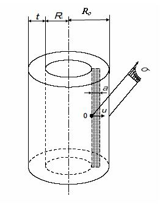

```python
from FFSeval import FFS as ffs
cls=ffs.Treat()
L=cls.Set('L-2-b')
data={
    'Ro':291,
    'Ri':275,
    't':16,
    'p':8,
    'a':0.8,
    'c':5.0,
    'Sy':514.0}
L.SetData(data)
L.Calc()
res=L.GetRes()
res
#{'Lr': 0.24457281012056953, 'pc': 32.71009559916394}

```
