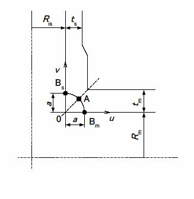

```python
from FFSeval import FFS as ffs
cls=ffs.Treat()
K=cls.Set('L-3-b')
data={'a':10,
      'Ris':50.,
      'Rim':120.,
      'tn':20,
      'tm':20,
      'p':20,
      'Sy':380,
}
K.SetData(data)
K.Calc()
res=K.GetRes()
res
#{'Lr_sph': 0.8344887596205853, 'Lr_cyl': 0.808232895312898}
```
