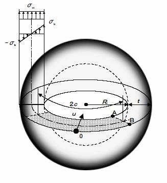

```python
from FFSeval import FFS as ffs
cls=ffs.Treat()
K=cls.Set('L-6-c')
data={'l':30,
      'Ri':100.,
      't':20,
      'Sy':380,
      'sigma_m':20.
}
K.SetData(data)
K.Calc()
res=K.GetRes()
res
#{'Lr': 0.0627853121792778}
```
